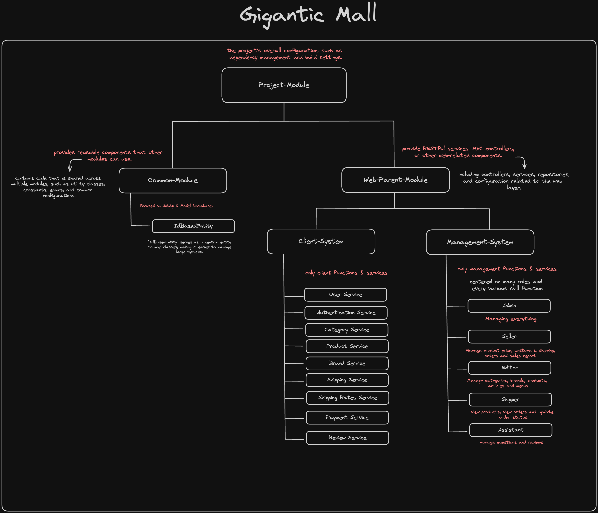
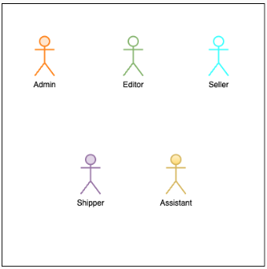
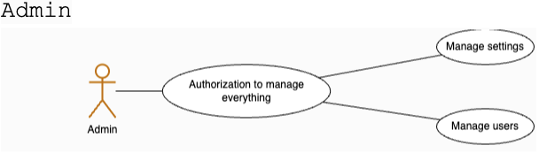
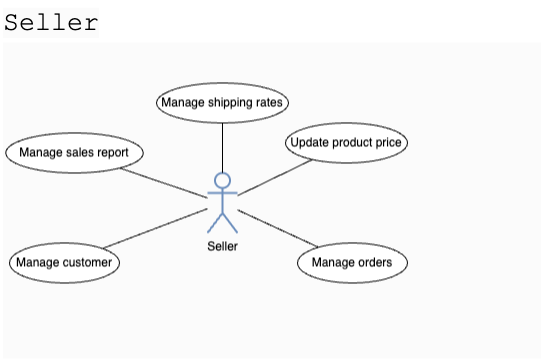
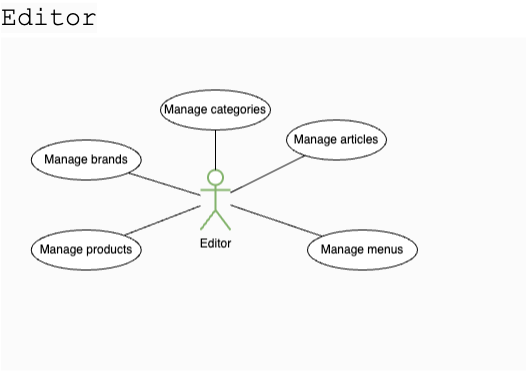
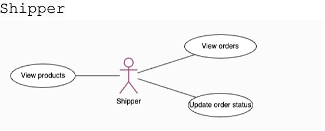
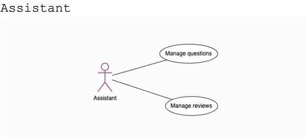
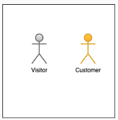
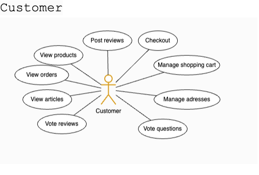
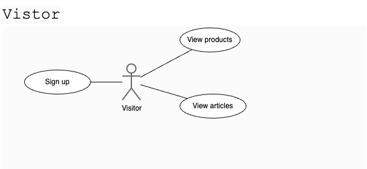

# Gigantic-Mall-App


Gigantic-Mall-App is a comprehensive e-commerce application developed using Spring Boot for the backend and React for the frontend. This project employs a Spring multi-module architecture, consisting of various modules for different functionalities.

## Project Structure

The project is divided into multiple modules:



- **Gigantic Common**: Contains common entities using `IdBasedEntity`.
- **Gigantic Parent**: Parent module that includes:
  - **Management System**: Handles management functions for a bookstore.
  - **Client System**: Manages client-side functionalities like buying items.

## Features

### Common

- Utilizes `IdBasedEntity` for common entities.

### Management System

Focused on various roles and their respective functions:



- **Admin**: Manages everything.
- **Seller**: Manages product prices, customers, shipping, orders, and sales reports.
- **Editor**: Manages categories, brands, products, articles, and items.
- **Shipper**: Views products, views orders, and updates order statuses.
- **Assistant**: Manages questions and reviews.

- admin


- seller


-editor


-shipper


-assistant



### Client System


Provides various services to the clients:



- **User Service**: Manages user-related functionalities.
- **Authentication Service**: Handles user authentication.
- **Category Service**: Manages product categories.
- **Product Service**: Manages products.
- **Brand Service**: Manages brands.
- **Shipping Service**: Handles shipping processes.
- **Shipping Rates Service**: Manages shipping rates.
- **Payment Service**: Manages payment processes.
- **Review Service**: Manages product reviews.

- visitor



- customer


## Implementation Details

This project is developed by second-year Software Engineering students. We plan to host the application on Heroku, and profile and product images will be uploaded to AWS free tier.

## Getting Started

### Prerequisites

- Java 11 or higher
- Node.js and npm
- Spring Boot
- React

### Installation

1. Clone the repository:
   ```bash
   git clone https://github.com/6531503042/Gigantic-Mall-App.git

2. Navigate to the project directory:
   ```bash
   cd Gigantic-Mall-App

3. Build the backend:
   ```bash
    cd backend
    ./mvnw clean install

4. Start the backend server:
    ```bash
    ./mvnw spring-boot:run

5. Navigate to the frontend directory and install dependencies:
    ```bash
    cd ../frontend
    npm install

6. Start the frontend server:
    ```bash
    npm start

## Usage

Access the management system via http://localhost:8080/gigantic.
Access the client system via http://localhost:3000.

## Contributing

Contributions are welcome! Please create a pull request or open an issue to discuss any changes.

## License

This project is licensed under the MIT License. See the LICENSE file for details.

## Authors

### Nimit Tanboontor
- **Student ID**: 6531503042
- **Role**: 
  - Backend Development
  - Database Management System
  - Design UX/UI
- **GitHub**: [Nimit Tanboontor][(https://github.com/6531503042)

### Kongphop
- **Student ID**: 6531503008
- **Role**:
  - Frontend Development
  - Design UX/UI
- **GitHub**: [Kongphop Saenphai ][(https://github.com/kongphop1209)

### Contributors
- [Contributors' Names] (replace with actual names and GitHub profiles)


