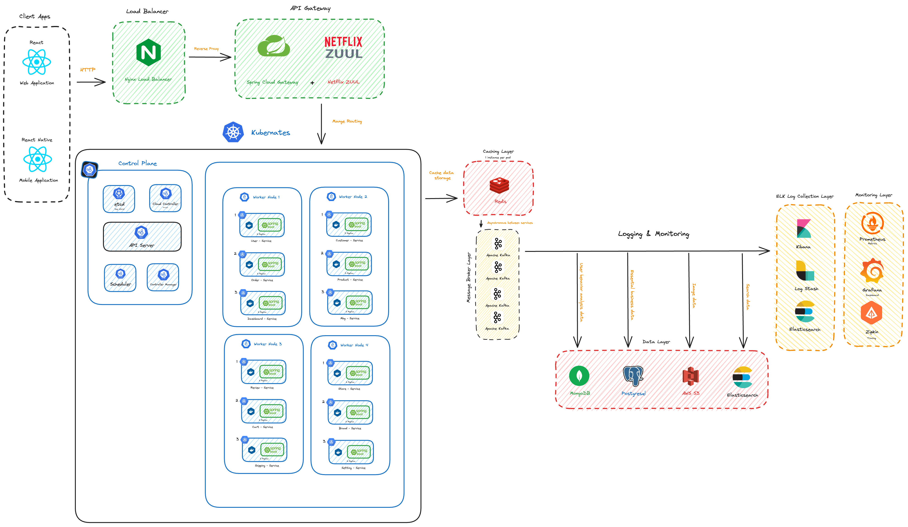

# Gigantic-Mall-App


Gigantic-Mall-App is a comprehensive e-commerce application developed using Spring Boot for the backend and React for the frontend. This project employs a built using microservices architecture, deployed on Kubernetes. It includes various services, a gateway, load balancing, caching, messaging, logging, monitoring, and persistent data storage.

# E-commerce Microservices Architecture

This project demonstrates a comprehensive e-commerce system built using microservices architecture, deployed on Kubernetes. It includes various services, a gateway, load balancing, caching, messaging, logging, monitoring, and persistent data storage.

## Table of Contents

- [Architecture Overview](#architecture-overview)
- [Technologies Used](#technologies-used)
- [Setup and Deployment](#setup-and-deployment)
- [Configuration](#configuration)
- [Usage](#usage)
- [Contributing](#contributing)
- [License](#license)

## Architecture Overview



### Components:

1. **Client Apps**:
   - React Web Application
   - React Native Mobile Application

2. **Load Balancer**:
   - Nginx

3. **API Gateway**:
   - Spring Cloud Gateway
   - Netflix Zuul

4. **Kubernetes Cluster**:
   - Control Plane
     - etcd
     - Kube-API Server
     - Controller Manager
     - Scheduler
   - Worker Nodes
     - Pods for each microservice

5. **Microservices**:
   - User Service
   - Customer Service
   - Order Service
   - Product Service
   - Store Service
   - Setting Service
   - Dashboard Service
   - Review Service
   - Brand Service
   - Cart Service
   - Shipping Service
   - MBG Service

6. **Caching Layer**:
   - Redis

7. **Message Broker Layer**:
   - Apache Kafka

8. **Logging and Monitoring**:
   - ELK Stack (Elasticsearch, Logstash, Kibana)
   - Prometheus
   - Grafana
   - Zipkin

9. **Data Layer**:
   - MongoDB
   - PostgreSQL
   - AWS S3
   - Elasticsearch

## Technologies Used

- **Frontend**: React, React Native
- **Backend**: Spring Boot, Spring Cloud Gateway, Netflix Zuul
- **Containerization**: Docker
- **Orchestration**: Kubernetes
- **Load Balancing**: Nginx
- **Caching**: Redis
- **Messaging**: Apache Kafka
- **Logging**: ELK Stack (Elasticsearch, Logstash, Kibana)
- **Monitoring**: Prometheus, Grafana, Zipkin
- **Databases**: MongoDB, PostgreSQL, AWS S3, Elasticsearch

## Setup and Deployment

### Prerequisites

- Docker
- Kubernetes
- Helm
- Kafka
- Redis
- PostgreSQL
- MongoDB
- AWS S3
- ELK Stack
- Prometheus & Grafana

### Clone the Repository

````bash
git clone https://github.com/6531503042/Gigantic-Mall.git
cd gigantic-mall
````

### Build and Deploy

````bash
docker-compose build
docker-compose push
````

### Deploy on K8s
````bash
kubectl apply -f k8s/
````

### Deploy Kafka
````bash
helm repo add confluentinc https://packages.confluent.io/helm
helm install kafka confluentinc/cp-helm-charts
````

### Deploy Redis
````bash
helm repo add bitnami https://charts.bitnami.com/bitnami
helm install redis bitnami/redis
````

### Deploy PostgreSQL
````bash
helm repo add bitnami https://charts.bitnami.com/bitnami
helm install postgresql bitnami/postgresql
````

### Deploy MongoDB
````bash
helm repo add bitnami https://charts.bitnami.com/bitnami
helm install mongodb bitnami/mongodb
````

## Confighuration

### Environtment Variables
Each service has a .env file where you can set up environment variables. Refer to the example .env.example files in each service directory.
- `KAFKA_BROKER_URL`: Kafka broker URL
- `REDIS_HOST`: Redis host
- `POSTGRES_HOST`: PostgreSQL host
- `MONGODB_HOST`: MongoDB host
- `AWS_S3_BUCKET`: AWS S3 bucket name
- `ELK_HOST`: ELK host
- `PROMETHEUS_HOST`: Prometheus host
- `GRAFANA_HOST`: Grafana host

## Usage

### Access the Appliaction

- Web Application: http://your-nginx-load-balancer-ip
- Mobile Application: Use the mobile app with the backend services.

### Monitorting and Logs

- Kibana: `http://your-kibana-ip`
- Grafana: `http://your-grafana-ip`
- Prometheus: `http://your-prometheus-ip`
- Zipkin: `http://your-zipkin-ip`

### License

This project is licensed under the MIT License. See the LICENSE file for details.

## Authors

### Nimit Tanboontor
- **Student ID**: 6531503042
- **Role**:
  - Backend Development
  - Frontend Development
  - Database Management System
  - DevOps
  - Design UX/UI
  - Architecture Design
  - Deployment Design
- **GitHub**: [Nimit Tanboontor](https://github.com/6531503042)

### Kongphop Saenphai
- **Student ID**: 6531503008
- **Role**:
  - Frontend Development
  - Design UX/UI
- **GitHub**: [Kongphop Saenphai](https://github.com/kongphop1209)

### Kritsakorn Sukkasem
- **Student ID**: 6531503005
- **Role**:
  - Frontend Development
  - Backend Development
  - Design UX/UI
- **GitHub**: [Kritsakorn Sukkasem](https://github.com/Kritsasoft)

### Phumiphat Wongsathit
- **Student ID**: 6531503117
- **Role**:
  - Frontend Development
  - Design UX/UI
- **GitHub**: [Phumiphat Wongsathit](https://github.com/frank1nz)

<!-- # - **Admin**: Manages everything.
# - **Seller**: Manages product prices, customers, shipping, orders, and sales reports.
# - **Editor**: Manages categories, brands, products, articles, and items.
# - **Shipper**: Views products, views orders, and updates order statuses.
# - **Assistant**: Manages questions and reviews.

# - admin
# 

# - seller
# 

# -editor
# 

# -shipper
# 

# -assistant
# 

